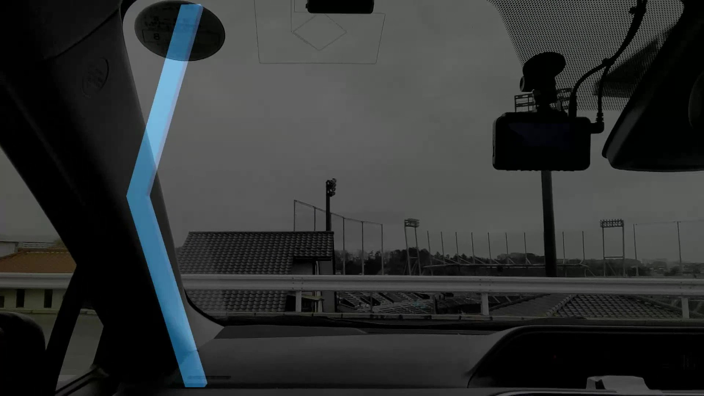

# ar-steering-curve-visualization
ハンドル操作情報を基に，将来の進行方向をARグラスに提示するシステムになります．

# 折れ線バーの提示


# ファイル構成
```
ar-steering-curve-visualization/
├── sensor_program/ # ノートPC
│ ├── bwt901cl_2sensor.py # class_bwt901cl.pyを利用して，Unityアプリへデータを送信する
│ └── class_bwt901cl.py # IMUセンサーbwt901clからデータを取得する
└── unity/ # Androidスマホ
  ├── model/ # 折れ線バーの3Dモデル
  └── scripts/
    ├── UDPReceiver.cs # センサーデータを受け取り，データを格納する
    ├── DataProcessor.cs　# データを基に，表示に反映する
    ├── CSVWriter.cs # 変数をcsvに記録する
    └── ExitManager.cs # アプリの終了を管理する
```
